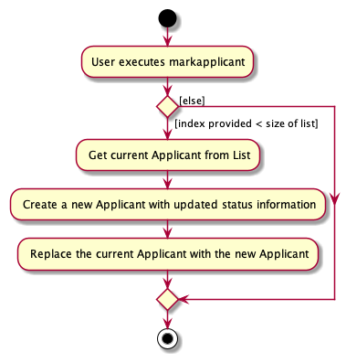

### MarkApplicant feature

The `markapplicant` mechanism is facilitated by `AddressBook`. `MarkApplicant` extends `Command` class.
`MarkApplicant` updates the status via creating a new applicant object with  the new status value
and same original Applicant details.  This new Applicant object will replace the current Applicant object that is in the `AddressBook`.

When the user wants to mark an applicant, the user will input `markapplicant` along with the index number of Applicant, 
and the new status value, which includes `pending`, `rejected`, and `accepted`

For example, `markapplicant 1 s/rejected` will change the status of applicant in index 1 to rejected.

Given below is an example usage scenario, and how the `markapplicant` mechanism behaves at each step.

Step 1. The user inputs `markapplicant 1 s/rejected` into ReCLIne. `AddressBookParser#parseCommand()` 
and `MarkApplicantParser#parse()`. `MarkApplicantParser#parse()`calls `ParserUtil#parseIndex()` and `ParserUtil#parseApplicant()`,
which returns Index and ApplicantStatus objects representing the index and status value that user inputted. This returns a
`MarkApplicant` with Index and ApplicantStatus objects as arguments.

:information_source: **Note:** If the `index` inputted is greater than the
size of the current `UniqueApplicantList` the execution of the command will fail. A `CommandException` will be thrown
and displayed for the user. This ensures that inputted `index` is not out of bound.

The following sequence diagram shows how the `markapplicant` command works:

The following activity diagram summarizes what happens when a user executes a new `markapplicant` command:

